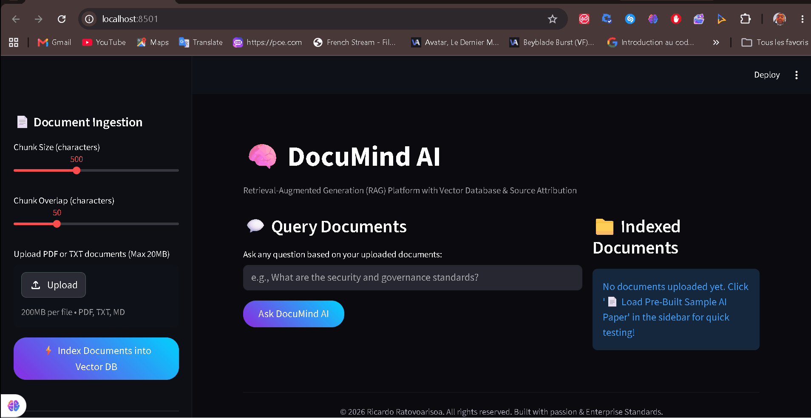
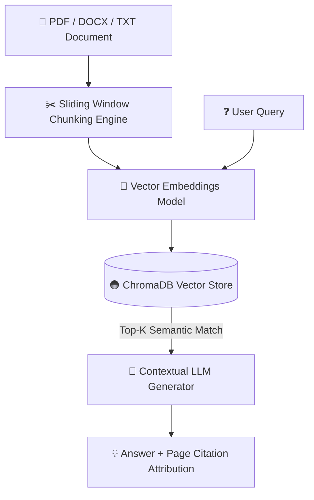

# DocuMind AI 🧠

<div align="center">
  <h3>Enterprise RAG & Document Intelligence Platform</h3>
  <p><em>Plateforme RAG & Intelligence Documentaire d'Entreprise</em></p>

  <br />
  
  <!-- Demonstration Banner -->
  <div style="border: 1px solid rgba(255,255,255,0.2); border-radius: 12px; padding: 10px; background: rgba(0,0,0,0.5);">
    
    <p><sub>🎬 <b>Demonstration / Aperçu Visuel :</b> Remplacez <code>preview.gif</code> par la vraie démo animée du projet.</sub></p>
  </div>

  <br />
      
</div>

---

<details open>
  <summary><b>📌 Table of Contents / Table des matières</b></summary>
  <ul>
    <li><a href="#-english">🇬🇧 English</a></li>
    <ul>
      <li><a href="#-about-the-project">About the Project</a></li>
      <li><a href="#-architecture--data-flow">Architecture & Data Flow</a></li>
      <li><a href="#-key-features">Key Features</a></li>
      <li><a href="#-getting-started">Getting Started</a></li>
    </ul>
    <li><a href="#-français">🇫🇷 Français</a></li>
    <ul>
      <li><a href="#-à-propos-du-projet">À propos du projet</a></li>
      <li><a href="#-architecture--flux-de-données">Architecture & Flux de données</a></li>
      <li><a href="#-fonctionnalités-clés">Fonctionnalités clés</a></li>
      <li><a href="#-démarrage-rapide">Démarrage rapide</a></li>
    </ul>
    <li><a href="#-license--licence">📜 License / Licence</a></li>
  </ul>
</details>

---

## 🇬🇧 English

### 📖 About the Project
DocuMind AI is an enterprise-grade Retrieval-Augmented Generation (RAG) platform that performs sliding-window vector chunking, semantic embedding search via ChromaDB, and page-attributed question answering.

### 🏗️ Architecture & Data Flow


### ✨ Key Features
- 📄 **Multi-Format Ingestion**: Process PDFs, DOCX, TXT, and Markdown files seamlessly
- 🧮 **Vector Chunking Engine**: Configurable overlap & window chunking strategies
- 🔍 **Semantic Search**: Fast local vector similarity search with ChromaDB
- 📌 **Source Attribution**: Exact page number and snippet highlights for total transparency

### 💻 Getting Started
To install and run this project locally:
```bash
python -m venv venv
venv\Scripts\activate
pip install -r requirements.txt
streamlit run app.py
```

---

## 🇫🇷 Français

### 📖 À propos du projet
DocuMind AI est une plateforme RAG (Retrieval-Augmented Generation) d'entreprise qui effectue le découpage vectoriel glissant, la recherche par comparaison sémantique avec ChromaDB et la réponse aux questions avec attribution exacte de page.

### 🏗️ Architecture & Flux de données


### ✨ Fonctionnalités clés
- 📄 **Ingestion Multi-Formats**: Traitement rapide des fichiers PDF, DOCX, TXT et Markdown
- 🧮 **Moteur de Découpage Vectoriel**: Fenêtre glissante et chevauchement configurables
- 🔍 **Recherche Sémantique**: Recherche de similarité vectorielle locale via ChromaDB
- 📌 **Attribution des Sources**: Indication exacte des numéros de pages et extraits sources

### 💻 Démarrage rapide
Pour installer et lancer ce projet localement :
```bash
python -m venv venv
venv\Scripts\activate
pip install -r requirements.txt
streamlit run app.py
```

---

## 📜 License / Licence
Distributed under the MIT License. Copyright © 2026 **Ricardo Ratovoarisoa**. All rights reserved.

---
<div align="center">
  <sub>Built with ❤️ by <b>Ricardo Ratovoarisoa</b> | AI & Full-Stack Developer</sub>
</div>
